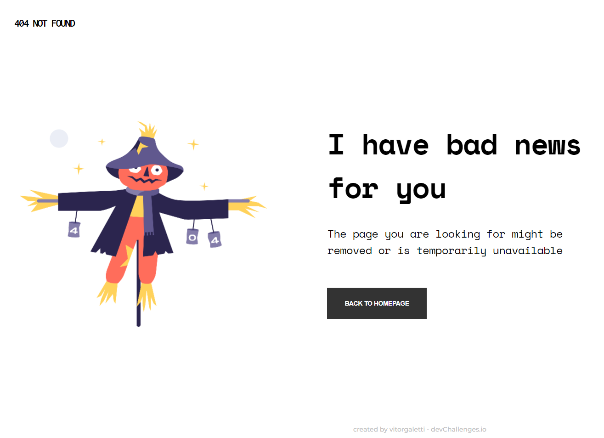
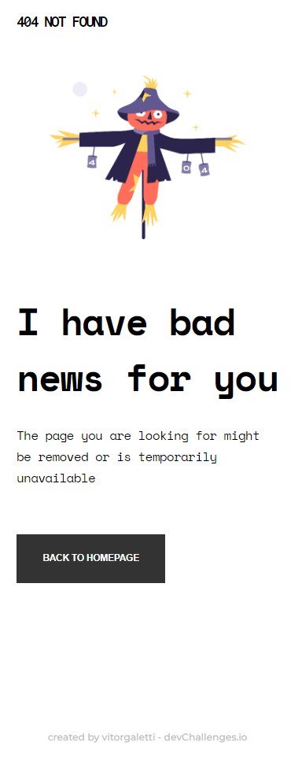

<h1 align="center">404 Not Found</h1>

   Solution for a challenge from  <a href="http://devchallenges.io" target="_blank">Devchallenges.io</a>.

  <h3>
    <a href="https://404-not-found-vitor.vercel.app/">
      Demo
    </a>
     | 
    <a href="https://devchallenges.io/solutions/th3MXNJcvVvFlGXORifm">
      Solution
    </a>
     | 
    <a href="https://devchallenges.io/challenges/wBunSb7FPrIepJZAg0sY">
      Challenge
    </a>
  </h3>

## Table of Contents

- [Overview](#overview)
  - [Built With](#built-with)
- [Features](#features)
- [Contact](#contact)
- [Acknowledgements](#acknowledgements)

## Overview

### Built With

- [React](https://reactjs.org/)
- [Vue.js](https://vuejs.org/)
- [Tailwind](https://tailwindcss.com/)

## Features

This application/site was created as a submission to a [DevChallenges](https://devchallenges.io/challenges) challenge. The [challenge](https://devchallenges.io/challenges/wBunSb7FPrIepJZAg0sY) was to build an application to complete the given user stories.

## Acknowledgements

- [Steps to replicate a design with only HTML and CSS](https://devchallenges-blogs.web.app/how-to-replicate-design/)
- [Node.js](https://nodejs.org/)
- [Marked - a markdown parser](https://github.com/chjj/marked)

## Contact

- Website [devvitorgaletti.netlify.app](https://devvitorgaletti.netlify.app/)
- GitHub [@vitorgaletti](https://github.com/vitorgaletti)
- Twitter [@DevVitorGaleti](https://twitter.com/DevVitorGaleti)
